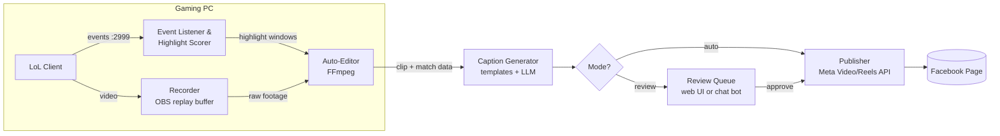

# LoL Highlights → Facebook Auto-Post Pipeline
**Concept Doc (Ideation)** · July 2026

## Vision
Play League of Legends normally. The system captures gameplay, detects highlight moments (kills, multikills, objectives, clutch plays), auto-edits them into short clips, writes a caption, and posts to Facebook — either fully automatically or after a one-tap review, configurable per user.

Serves three goals at once: sharing moments with friends, growing a gaming FB page with consistent output, and a strong portfolio/learning project.

## Pipeline Stages

### 1. Capture — **DECIDED: Option A**
Record gameplay while LoL is running.
- **Option A — OBS (headless via obs-websocket) ← chosen:** free, open source, scriptable, replay buffer support. Most control, most work.
- ~~Option B — Existing auto-clippers (Medal.tv, Outplayed, Eklipse)~~ — rejected: closed source, ToS constraints.
- ~~Option C — Game Bar / ShadowPlay~~ — rejected: less scriptable.

### 2. Highlight Detection
Know *when* something clip-worthy happened.
- **Riot Live Client Data API** (localhost:2999 during a live game): real-time event feed — ChampionKill, Multikill, DragonKill, BaronKill, Ace, FirstBlood. Timestamped, no screen analysis needed. This is the cleanest signal and the core enabler of the whole idea.
- **Overwolf Game Events API:** kill/death/assist/level events if building on the Overwolf platform.
- **Fallback — vision/audio detection:** OCR the killfeed or detect announcer audio ("Double Kill!"). More fragile; only needed if the local API is unavailable.

Detection strategy: listen to the event stream, score events (pentakill ≫ single kill), and when score crosses a threshold, mark `[t-8s, t+4s]` as a highlight window against the recording timeline.

### 3. Auto-Edit
Turn raw windows into postable clips.
- **MVP:** FFmpeg cut at highlight windows, merge adjacent windows, add fade in/out. Crop/pad to 9:16 for Reels (kill area center-screen).
- **V2:** stitch multi-moment "game recap" (all kills + final nexus), overlay stats (KDA, champ, rank), intro/outro card, background-music bed with game-audio ducking.
- **Alternative:** delegate editing to Eklipse/FragCut-style AI editors and only own detection + posting.

### 4. Caption Generation
- Match data from Live Client API / Riot Match-V5 gives everything needed: champion, KDA, multikill type, win/loss, game duration.
- Template + LLM hybrid: templates guarantee facts ("Pentakill on Katarina — 18/3/7 win 🔥"), LLM adds flavor/variety and hashtags (#LeagueOfLegends #Pentakill). Configurable tone (hype / deadpan / friend-group inside jokes).
- **DECIDED: open-source models, locally hosted or free-tier** — e.g. Qwen or DeepSeek via Ollama/llama.cpp on the gaming GPU (caption gen runs post-game, so no VRAM contention). Zero API cost; a 7B–14B instruct model is plenty for captions.

### 5. Review Gate (configurable)
- **Auto mode:** post immediately when clip score ≥ threshold.
- **Review mode:** clip + caption land in a queue (simple local web page, or Messenger/Telegram bot message with ✅/❌ buttons). Approve, edit caption, or discard. Per-rule config: e.g., pentakills auto-post, single kills always need review.

### 6. Publish to Facebook
- **Meta Video API / Reels Publishing API:** `POST /<PAGE_ID>/video_reels` (Reels) or `/<PAGE_ID>/videos` with a Page access token. Reels specs: 9:16, ≥540×960, 4–60s (longer clips → regular video post instead).
- **Key constraint:** the Graph API only publishes to **Pages** (and groups), not personal profiles. Auto-posting to your personal timeline isn't supported — this pushes the project naturally toward the "grow a page" goal. For friends-only sharing, the review-gate bot could hand you the clip to share manually.
- Requires a Meta developer app with `pages_manage_posts` etc.; posting to a Page you own needs no App Review for your own use (dev mode).

## Architecture

## Risks & Open Questions
- **Riot ToS:** Live Client Data API is officially provided and read-only — fine. Third-party overlays/automation around the client are generally tolerated when not gameplay-affecting, but worth a check of Riot's developer policies before publishing anything.
- **Meta platform risk:** API versions deprecate ~every 2 years; token expiry needs a refresh flow. Personal-profile posting is a hard no (see above).
- **Quality control in auto mode:** a "highlight" of you getting a kill then instantly dying may embarrass; scorer needs a death-after-kill penalty. Review mode is the safety net.
- **Undocumented Live Events API** (richer events) only works in spectator/replay — not usable live; stick to Live Client Data API.
- **Music copyright:** background tracks can trip FB content ID; use FB Sound Collection or no music.
- **Compute:** recording + encoding while gaming; use GPU encode (NVENC), edit after game ends, not during.

## MVP Scope (weekend-sized)
1. Python listener polling `https://127.0.0.1:2999/liveclientdata/eventdata` during a game; log highlight windows.
2. OBS records full game; FFmpeg cuts clips post-game.
3. Template-only captions from event data.
4. Manual review queue = a folder + a simple "approve → post" script calling the Reels API on a test Page.
5. Then iterate: LLM captions → chat-bot review → auto mode with score threshold.

## Decisions So Far
- Capture: **OBS headless via obs-websocket** (Option A).
- AI stack: **open-source models** (Qwen/DeepSeek class via Ollama), no paid APIs.
- Posting modes: **both auto and review-before-post**, configurable per rule.
- Everything else (scoring rules, review-gate UX, editing depth, repo structure) = open, to be resolved in the `/grill-with-docs` session.

## Suggested Next Steps (per project SOP)
- **Ideation (here):** done — this doc.
- **Development (Claude Code):** start with `/grill-with-docs` seeded by this doc, then to-prd → implement.
